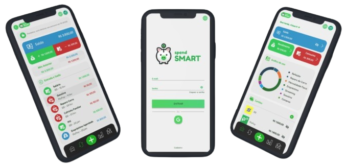

# spendSMART
O SpendSMART é uma aplicação web com o intuito de ajudar a instruir financeiramente usuários e famílias a alcançarem vidas mais estáveis e planejadas. Através de uma interface intuitiva e amigável, os usuários podem monitorar seus gastos, definir orçamentos e visualizar relatórios detalhados sobre suas finanças.

## Funcionalides
- Controle automático de consumo.
- Implementação com notificações.
- Adicione suas contas e cartões no mesmo lugar.
- Ações especiais para familias (mesada embutida, cofrinhos compartilhados, etc).

